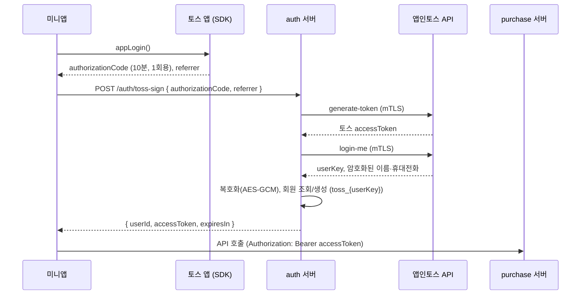

# 토스 로그인 연동

2026-10-08 기준 (처음 작성 2026-09-29). 미니앱과 auth 서버 구현, dev·운영 서버 배포가 끝났어요. 남은 일은 인트로 페이지, 연결 끊기 처리, 콘솔 설정이에요.

## 왜 필요한가

- 미니앱에서는 **토스 로그인만** 쓸 수 있어요. 자사 로그인이나 다른 간편 로그인은 쓸 수 없어요.
- 리퍼센트 회원 ID가 있어야 신청(`POST /purchases/product`)과 판매 내역 조회가 동작해요.
- iOS는 서드파티 쿠키를 막아서, 미니앱(`*.tossmini.com`)에서 리퍼센트 서버 쿠키로는 로그인 상태를 유지할 수 없어요. 그래서 **토큰을 응답 본문으로 받아 `Authorization` 헤더로 보내요.**

## 흐름



- `appLogin()`은 처음 한 번만 토스 약관 동의 화면을 띄우고, 이후에는 화면 없이 바로 인가 코드를 돌려줘요.
- 약관 동의 화면은 토스가 콘솔 설정(서비스 이용약관, 개인정보 제3자 제공, 동의 항목 이름·휴대전화)으로 만들어 띄워요. 미니앱이 따로 만들지 않아요.
- 인가 코드를 토큰으로 바꾸는 일과 사용자 정보 조회·복호화는 **서버에서만** 해요. 토스 accessToken은 auth 서버 안에서만 쓰고, 미니앱에는 리퍼센트 토큰만 와요.
- 토스 회원은 `firebase_uid = toss_{userKey}`로 식별하고, 기존 웹 회원과 이메일로 합치지 않아요. 두 계정을 연결할지는 별도로 정해야 해요.
- 토큰 발급 방식은 2026-09-29에 정했어요: `/auth/toss-sign`이 회원 조회·생성까지 하고 리퍼센트 access token을 바로 응답 본문으로 돌려줘요 (Firebase 커스텀 토큰을 거치는 방식은 쓰지 않음).

## 미니앱에서의 동작

| 단계     | 하는 일                                                                                                              | 코드                                                          |
| -------- | -------------------------------------------------------------------------------------------------------------------- | ------------------------------------------------------------- |
| 로그인   | `useAuth().login()` → `loginWithToss()` → `appLogin()` → `POST /auth/toss-sign`                                      | `src/components/Common/AuthProvider.tsx`, `src/auth/login.ts` |
| 세션     | SDK `Storage`의 `repercent:session`에 userId·accessToken·만료 시각 저장. 만료 1분 전을 만료로 봐요                   | `src/auth/session.ts`                                         |
| 앱 시작  | 저장된 세션만 조용히 불러와요. 로그인 창은 띄우지 않아요                                                             | `AuthProvider`                                                |
| API 호출 | `purchaseApi` 인터셉터가 `Authorization: Bearer <토큰>`을 붙여요. **요청마다 `login()`을 부르지 않아요**             | `src/utils/api.ts`                                            |
| 만료     | 토큰 유효 기간 24시간(auth 서버 `jwt.access-token-expire-seconds`). 401이면 세션을 지우고 "로그인이 만료됐어요" 안내 | `AuthProvider`                                                |

- `login()`은 이미 로그인돼 있으면 `appLogin()`도 서버도 부르지 않고 저장된 userId를 바로 돌려줘요. 여러 번 눌러도 로그인은 한 번만 하고, 실패·취소는 토스트로 알려요.
- **`appLogin()`을 직접 부르지 않아요.** 인가 코드는 10분짜리 1회용이라 토큰으로 바꾸지 않으면 버려지고, 동의만 받은 채 로그인은 안 된 상태가 돼요. 동의만 따로 받는 API는 없어요.

지금 로그인이 시작되는 곳 (모두 사용자가 버튼을 눌렀을 때):

- 홈 '판매 내역' 카드 — 이동하기 전에 로그인 (`src/container/HomeContainer.tsx`)
- 유의사항 '수거 신청하기' — 신청 API 직전 (`src/components/Agreement/AgreementComponent.tsx`)
- '토스로 로그인' 버튼 (`src/components/Common/LoginRequired.tsx`) — 로그인 안 된 상태로 판매 내역·상세·계좌·취소 화면에 들어왔을 때만 보이는 예외 화면이에요. Figma에는 없고, 토큰 만료·401·링크로 바로 진입한 경우에만 보여요. [인트로 페이지](#인트로-페이지와-로그인)를 만들 때 없애요.

## 인트로 페이지와 로그인

2026-10-08 결정. 디자인·문구가 나오면 한 PR로 만들어요.

비게임 출시 체크리스트 항목:

> 토스 로그인을 사용하는 경우, 어떤 서비스인지 알 수 있도록 인트로 페이지에서 서비스 설명을 제공해요.

> 미니앱에 진입하자마자 바텀시트(토스 로그인, 알림 동의문 등)가 자동으로 나타나지 않아요.

```
앱 진입 → 인트로(서비스 설명) → '시작하기' → login() → (처음이면 토스 약관 동의) → 홈
```

- 인트로를 맨 처음 화면으로 둬요. '시작하기'를 누르면 `login()`을 불러요. 이미 로그인된 사용자는 토스 화면 없이 바로 홈으로 가요.
- 약관 동의를 취소하거나 로그인에 실패하면 인트로에 남고 토스트로 알려요.
- `LoginRequired`와 판매 내역·상세·계좌·취소 화면의 로그인 안 됨 분기를 지우고, 세션이 없거나 만료됐거나 401이면 **인트로로 보내요.** 로그인 시작점은 인트로 '시작하기' 하나로 정리돼요.
- 판매 내역 카드·수거 신청하기의 `login()`은 남겨요. 앱을 켜 둔 채 토큰이 만료됐을 때 화면 없이 다시 로그인하는 길이에요.
- 화면에 들어오자마자 자동으로 다시 로그인하지 않아요. 토스에서 연결을 끊은 사용자는 약관 화면이 떠서 위 체크리스트 항목에 걸려요. 다시 로그인은 항상 사용자 동작에서만.
- 첫 화면이 인트로로 바뀌므로, 첫 화면에서 뒤로가기를 누르면 미니앱이 종료되는지 인트로 기준으로 확인해요.

## 할 일

### 콘솔 · 운영

- [ ] 사업자 등록 (토스 로그인 사용 조건, 검토 영업일 1~2일)
- [ ] 대표관리자 계정으로 토스 로그인 약관 동의
- [ ] 동의 항목 선택: 이름, 휴대전화. 휴대전화는 리퍼센트 회원 로그인과 알림톡 발송에 필요해요.
- [ ] 약관 링크 등록: 서비스 이용약관, 개인정보 수집·이용 동의 (마케팅 수신은 선택)
- [ ] 연결 끊기 콜백 등록: URL, 메서드, Basic Auth 값. 이름·이메일·성별 외 항목(휴대전화)을 받으면 필수예요.
- [ ] 복호화 키·AAD를 이메일로 받아 서버 비밀 저장소에 보관 (dev · 운영)
- [ ] 서버용 mTLS 인증서 발급 (dev · 운영)

### auth 서버 (repercent-auth)

- [x] 토큰 발급 방식 결정 (위 흐름)
- [x] `/auth/toss-sign` dev·운영 배포 (#63·#65 dev, #66 main, 2026-10-07)
- [x] 토스 사용자 가입·로그인 경로, 로그인 제공자(`UserAuth`)에 TOSS 추가
- [x] 휴대전화 번호 복호화해 회원 정보에 저장
- [x] 리퍼센트 access token을 응답 본문으로 반환 (`userId`, `accessToken`, `expiresIn`)
- [x] 테스트용 인가 코드 처리는 local·dev 프로필에서만 동작
- [x] CORS 허용 Origin에 미니앱 Origin 4개 추가
  - `https://21market.apps.tossmini.com`, `https://21market.private-apps.tossmini.com`
  - `https://21market.web.tossmini.com`, `https://21market.private-web.tossmini.com`
- [ ] mTLS 인증서·복호화 키를 Secrets Manager `repercent/auth/{env}/toss-login`에서 주입 (환경변수 지원은 #64로 완료, ECS 태스크 정의 연결 남음)
- [ ] 연결 끊기 콜백 엔드포인트: Basic Auth 검증 후 `UNLINK` · `WITHDRAWAL_TERMS` · `WITHDRAWAL_TOSS`에 맞춰 로그아웃·회원 처리
- [ ] 방화벽 Outbound 허용: `apps-in-toss-api.toss.im` (117.52.3.192, 211.115.96.192, 106.249.5.192 : 443)

### purchase 서버 (repercent-common-api)

- [x] 미니앱 Origin CORS 반영 (#903 dev, #904 main)
- [ ] `Authorization: Bearer` 토큰의 회원 정보로 요청자를 식별하도록 전환 (`@Access` 차단 모드)

### 미니앱 (이 저장소)

- [x] 로그인 모듈: `src/auth/login.ts`, 앱 전체 상태는 `AuthProvider` · `useAuth().login()`
- [x] auth 서버 주소 환경변수 (`VITE_AUTH_API_URL`, 빌드는 HTTPS)
- [x] `purchaseApi`에 `Authorization` 헤더 인터셉터, 401이면 세션 삭제 후 안내
- [x] 로그인은 **사용자 동작에서만** 시작. 앱 진입 직후 로그인 창을 띄우면 검수에서 반려돼요.
- [x] 홈의 "진행 중인 판매 N건"은 이미 로그인된 경우에만 조회
- [x] 세션은 SDK `Storage`에 저장
- [x] 로그인 실패·취소, 로그인 만료 안내
- [ ] [인트로 페이지](#인트로-페이지와-로그인): '시작하기'에서 `login()`, `LoginRequired` 제거, 세션 없음·만료·401이면 인트로로
- [ ] 토스 연결 해제 후 재로그인 안내 — 콜백 처리와 함께

## 테스트

| 환경              | 방법                                                                                           | 확인할 것                                                                         |
| ----------------- | ---------------------------------------------------------------------------------------------- | --------------------------------------------------------------------------------- |
| 로컬 브라우저     | `pnpm dev`. AIT Devtools 목업의 `appLogin()`은 `mock-auth-<uuid>` 코드와 `SANDBOX`를 돌려줘요. | dev auth 서버가 목업 코드를 테스트 회원으로 로그인시켜요 (local·dev 프로필에서만) |
| 콘솔 QR (토스 앱) | 번들 업로드 후 QR로 실행. Origin은 `private-apps`, referrer는 `DEFAULT`                        | 첫 로그인 약관 화면, 재방문 시 화면 없이 로그인, 신청·판매 내역                   |
| 연결 해제         | 토스 앱 > 설정 > 인증 및 보안 > 토스로 로그인한 서비스 > 연결 끊기                             | 콜백 수신, 앱 재진입 시 재로그인 안내                                             |

## 참고

- 토스 로그인 소개·콘솔 설정: https://developers-apps-in-toss.toss.im/guide/authentication/intro.md
- 토스 로그인 API (인가 코드, 토큰, 사용자 정보, 복호화): https://developers-apps-in-toss.toss.im/documentation/common/authentication/toss-login.md
- 서버 연동 (mTLS, CORS, 방화벽): https://developers-apps-in-toss.toss.im/documentation/integration/server-api.md
- 비게임 출시 체크리스트: https://developers-apps-in-toss.toss.im/checklist/app-nongame.md
- 출시 준비 현황: [apps-in-toss-launch.md](./apps-in-toss-launch.md)
