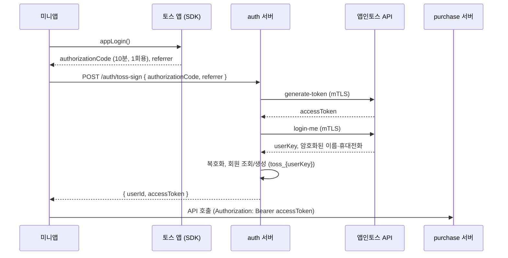

# 토스 로그인 연동 설계

2026-09-29 작성. 아직 구현 전이며, 앱인토스 개발자센터 문서와 현재 저장소 코드를 기준으로 정리했어요.

## 왜 필요한가

- 미니앱에서는 **토스 로그인만** 쓸 수 있어요. 자사 로그인이나 다른 간편 로그인은 쓸 수 없어요.
- 리퍼센트 회원 ID가 있어야 신청(`POST /purchases/product`)과 판매 내역 조회가 동작해요. 지금 앱은 회원 ID가 없으면 "로그인 후 확인할 수 있어요" 안내만 보여요.
- iOS는 서드파티 쿠키를 막아서, 미니앱(`*.tossmini.com`)에서 리퍼센트 서버 쿠키로는 로그인 상태를 유지할 수 없어요. **토큰을 응답 본문으로 받아 `Authorization` 헤더로 보내는 방식**이어야 해요.

## 목표 흐름

- `appLogin()`은 처음 한 번만 약관 동의 화면을 띄우고, 이후에는 화면 없이 바로 인가 코드를 돌려줘요.
- 인가 코드를 토큰으로 바꾸는 일과 사용자 정보 조회·복호화는 **반드시 서버**에서 해요.

## 결정할 것: 토큰 발급 방식

|             | A. 현재 코드 방식                                                                                              | B. 권장                                                                       |
| ----------- | -------------------------------------------------------------------------------------------------------------- | ----------------------------------------------------------------------------- |
| 흐름        | `/auth/toss-sign`이 Firebase 커스텀 토큰 반환 → 미니앱이 Firebase SDK로 로그인 → ID 토큰으로 `/auth/sign` 호출 | `/auth/toss-sign`이 회원 조회/생성까지 하고 리퍼센트 access token을 바로 반환 |
| 미니앱 부담 | Firebase SDK·설정 추가, 요청 3번                                                                               | 요청 1번                                                                      |
| 토큰 전달   | `/auth/sign`은 쿠키로만 발급 → iOS에서 동작 안 함, 본문 반환 추가 필요                                         | 처음부터 응답 본문으로 반환                                                   |
| 서버 변경   | `/auth/sign`에 토스 가입 경로와 본문 토큰 반환 추가                                                            | `/auth/toss-sign`에 회원 조회/생성과 토큰 발급 추가                           |

웹의 Firebase 로그인 흐름과 맞추고 싶다면 A, 미니앱만 놓고 보면 B가 단순해요.

## 할 일

### 콘솔 · 운영

- [ ] 사업자 등록 (토스 로그인 사용 조건, 검토 영업일 1~2일)
- [ ] 대표관리자 계정으로 토스 로그인 약관 동의
- [ ] 동의 항목 선택: 이름, 휴대전화. 휴대전화는 리퍼센트 회원 로그인과 알림톡 발송에 필요해요.
- [ ] 약관 링크 등록: 서비스 이용약관, 개인정보 수집·이용 동의 (마케팅 수신은 선택)
- [ ] 연결 끊기 콜백 등록: URL, 메서드, Basic Auth 값. 이름·이메일·성별 외 항목(휴대전화)을 받으면 필수예요.
- [ ] 복호화 키·AAD를 이메일로 받아 서버 비밀 저장소에 보관 (dev · 운영)
- [ ] 서버용 mTLS 인증서 발급 (dev · 운영)

### auth 서버 (repercent-auth)

- [ ] 토큰 발급 방식 결정 (위 표)
- [ ] `/auth/toss-sign`을 main에 반영 (현재 `origin/dev`에만 있음)
- [ ] 토스 사용자 가입·로그인 경로 추가. 로그인 제공자(`UserAuth`)에 TOSS 추가
- [ ] 토스에서 받은 휴대전화 번호를 복호화해 회원 정보에 저장 (현재는 이름·이메일만 복호화)
- [ ] 리퍼센트 access token을 응답 본문으로 반환하고, 만료 시 재로그인 흐름 정의
- [ ] 테스트용 인가 코드 처리는 dev 프로필에서만 동작하도록 제한
- [ ] CORS 허용 Origin에 미니앱 Origin 4개 추가 (현재 localhost, `*.repercent.com`만 허용)
  - `https://repercent-toss.apps.tossmini.com`, `https://repercent-toss.private-apps.tossmini.com`
  - `https://repercent-toss.web.tossmini.com`, `https://repercent-toss.private-web.tossmini.com`
- [ ] 연결 끊기 콜백 엔드포인트: Basic Auth 검증 후 `UNLINK` · `WITHDRAWAL_TERMS` · `WITHDRAWAL_TOSS`에 맞춰 로그아웃·회원 처리
- [ ] 방화벽 Outbound 허용: `apps-in-toss-api.toss.im` (117.52.3.192, 211.115.96.192, 106.249.5.192 : 443)

### purchase 서버 (repercent-common-api)

- [ ] 미니앱 Origin CORS 반영: repercent/repercent-common-api#825 → dev 배포 → main 대상 PR
- [ ] `Authorization: Bearer` 토큰의 회원 정보로 요청자를 식별하도록 전환 (`@Access` 차단 모드)

### 미니앱 (이 저장소)

- [ ] 로그인 모듈 추가 (예: `src/auth/login.ts`의 `ensureLogin()`): `appLogin()` → `/auth/toss-sign` → 토큰·회원 ID 저장
- [ ] auth 서버 주소 환경변수 추가 (예: `VITE_AUTH_API_URL`, 빌드는 HTTPS)
- [ ] `purchaseApi`(`src/utils/api.ts`)에 `Authorization` 헤더 인터셉터, 401이면 토큰 삭제 후 재로그인
- [ ] 로그인은 **사용자 동작에서만** 시작: 판매 내역 진입, 유의사항의 "수거 신청하기". 앱 진입 직후 로그인 창을 띄우면 검수에서 반려돼요.
- [ ] 홈의 "진행 중인 판매 N건"은 이미 로그인된 경우에만 조회
- [ ] 회원 정보 저장을 SDK `Storage` API로 전환하고 `src/utils/user.ts`의 `getUserId`를 비동기로 변경. 지금은 `localStorage`를 쓰는데, SDK 3.x 문서가 `localStorage` 직접 사용을 주의하라고 안내해요.
- [ ] 로그인 실패·취소, 토스 연결 해제 후 재로그인 안내 문구 ("토스 연결이 해제되어 다시 로그인해야 해요")

## 테스트

| 환경              | 방법                                                                                              | 확인할 것                                                              |
| ----------------- | ------------------------------------------------------------------------------------------------- | ---------------------------------------------------------------------- |
| 로컬 브라우저     | `npm run dev`. AIT Devtools 목업의 `appLogin()`은 `mock-auth-<uuid>` 코드와 `SANDBOX`를 돌려줘요. | auth 서버 dev의 테스트용 인가 코드 처리와 목업 코드 형식을 맞춰야 해요 |
| 콘솔 QR (토스 앱) | 번들 업로드 후 QR로 실행. Origin은 `private-apps`, referrer는 `DEFAULT`                           | 첫 로그인 약관 화면, 재방문 시 화면 없이 로그인, 신청·판매 내역        |
| 연결 해제         | 토스 앱 > 설정 > 인증 및 보안 > 토스로 로그인한 서비스 > 연결 끊기                                | 콜백 수신, 앱 재진입 시 재로그인 안내                                  |

## 참고

- 토스 로그인 소개·콘솔 설정: https://developers-apps-in-toss.toss.im/guide/authentication/intro.md
- 토스 로그인 API (인가 코드, 토큰, 사용자 정보, 복호화): https://developers-apps-in-toss.toss.im/documentation/common/authentication/toss-login.md
- 서버 연동 (mTLS, CORS, 방화벽): https://developers-apps-in-toss.toss.im/documentation/integration/server-api.md
- 출시 준비 현황: [apps-in-toss-launch.md](./apps-in-toss-launch.md)
